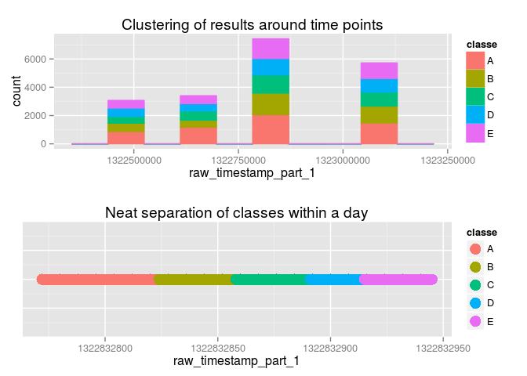

# Predicting Bicep Curl Correctness
Tamas Zsebe  


## Synopsis

In an experiment, a number of subjects were asked to perform bicep curls a number of ways, while wearing several accelerometers on their bodies. The manner in which the curls were performed were split into five classes: _A_ for perfect execution, and _B_, _C_, _D_, and _E_ for specific types of mistakes. For more information about the research, consult: http://groupware.les.inf.puc-rio.br/har

In this project, we are tasked with building a machine learning model to predict the relevant move class, given all other collected data. We are provided with a training set, and a small final test set with 20 rows, to predict.


## Selecting and building our model

### Loading up data

We begin by loading the data set, being mindful of how NAs are formatted.


```r
# -1 to get rid of the obnoxious "row numbers" column
raw_training_set <- read.csv("pml-training.csv", na.strings = c("NA", "#DIV/0!"))[,-1]
```

We notice early on that there are a very large number of columns with mostly NA values. In fact, as shown below, any given column has either NO NA values, or over 95% of its values are NA.


```r
# Verify ratio of NAs for each column.
na_ratios <- sapply(names(raw_training_set), function(name) {
    col <- raw_training_set[,name]
    sum(is.na(col))/length(col)
}) 
table(na_ratios == 0 | na_ratios > 0.95)
```

```
## 
## TRUE 
##  159
```

```r
# Filter out those garbage columns.
full_training_set <- raw_training_set[,na_ratios == 0]
```

### A note about code used

From here on out, and for all training/predicting functionality, I will be using some R code infrastructure I built up, to make experimentation easier to work with. This entire mini-library is available in the Appendix, for completeness. The basic components are:

* _partitionData_: Given a dataset and ratio, split data into two sets. This basically wraps the `createDataPartition` call we've been using in class.
* _trainModel_: Wraps `train`, and saves/loads to/from disk. It only uses the formula `classe ~ .`, so the data frame has to be filtered down to the chosen predictors.
* _evaluateModel_: Wraps `predict`, and runs it on both the training and testing data. The test accuracy provides an out of sample error estimate for all models we build.
* _trainAndEvaluateModels_: Given a vector of predictors, it uses the above methods to train multiple models, adding a predictor one at a time. Think of it as similar to `anova` in regression modeling.


### A quick benchmark model

Before we go any deeper, it is good practice to build a random forest model on this entire data set, just to see what we're working with. Who knows, maybe we'll be lucky.


```r
partitioned_full_as_is <- partitionData(full_training_set, 0.7)
model_full_as_is <- trainModel("full_as_is", partitioned_full_as_is$training, "rf")
result_full_as_is <- evaluateModel(model_full_as_is, partitioned_full_as_is)
result_full_as_is
```

```
##            model_name train_acc test_acc train_time
## 1 model_rf_full_as_is         1   0.9993   00:57:32
```

We seem to have achieved a near-perfect model, with a > 99.9% accuracy! This is a bit fishy, so let's have a look at the importance of the various predictors.


```r
varImp(model_full_as_is$model)
```

```
## rf variable importance
## 
##   only 20 most important variables shown (out of 80)
## 
##                                Overall
## raw_timestamp_part_1           100.000
## num_window                      49.018
## roll_belt                       44.240
## pitch_forearm                   28.158
## magnet_dumbbell_z               19.514
## magnet_dumbbell_y               16.897
## pitch_belt                      13.139
## yaw_belt                        12.474
## roll_forearm                    11.455
## cvtd_timestamp30/11/2011 17:12  10.941
## cvtd_timestamp02/12/2011 14:58   9.068
## cvtd_timestamp02/12/2011 13:33   8.382
## cvtd_timestamp28/11/2011 14:15   7.943
## magnet_dumbbell_x                7.780
## accel_belt_z                     6.639
## magnet_belt_y                    5.946
## accel_dumbbell_y                 5.879
## roll_dumbbell                    5.796
## cvtd_timestamp05/12/2011 14:24   5.067
## accel_forearm_x                  4.868
```

It would appear that the timestamp is contributing disproportionately heavily to this model. Let's take a closer look.

It turns out that the subjects were visiting one at a time, and performing ALL reps of each class one after the other. This means that, based on the timestamp, as long as your validation set is from the same data, you will get a false sense of accuracy. We can see this nice split based timestamp in the plot below.

 

Just because it's an amusing result, let's see what happens when we try to train the model on just that one parameter.


```r
trainAndEvaluateModels(full_training_set, "just_dates", "rf", c("classe"), c("raw_timestamp_part_1"))
```

```
##                  model_name train_acc test_acc train_time
## 1 model_rf_just_dates_1vars    0.9935   0.9918   00:01:05
```

Another highly-accurate model! Of course, this is garbage. We would like for this model to be usable for arbitrary subjects, at arbitrary times.

### Modeling with the right data

With that exploration out of the way, we remove all of the misleading "metadata" fields, and keep only the classe and the raw measurements.

Note that we verify if there are any near-zero-variance values remaining as part of the process, and it turns out there aren't any. We'll use Random Forests, and Boosting, with defaults. Not shown here are the swaths of experiments I had performed with various other methods.


```r
all_measurements_and_classes <- select(full_training_set, -(user_name:num_window))
paste("Number of NZVs:", sum(nearZeroVar(all_measurements_and_classes, saveMetrics = TRUE)$nzv))
```

```
## [1] "Number of NZVs: 0"
```

```r
partitioned_all_measurements <- partitionData(all_measurements_and_classes, 0.7)

model_all_measurements_rf <- trainModel("all_measurements", partitioned_all_measurements$training, "rf")
model_all_measurements_gbm <- trainModel("all_measurements", partitioned_all_measurements$training, "gbm", 
                                          verbose = FALSE)

result_all_measurements_rf <- evaluateModel(model_all_measurements_rf, partitioned_all_measurements)
result_all_measurements_gbm <- evaluateModel(model_all_measurements_gbm, partitioned_all_measurements)
rbind(result_all_measurements_rf, result_all_measurements_gbm)
```

```
##                   model_name train_acc test_acc train_time
## 1  model_rf_all_measurements    1.0000   0.9942   00:45:07
## 2 model_gbm_all_measurements    0.9744   0.9619   00:17:23
```

Very respectable results, with out of sample accuracy rates in the high 90s (or error rates below 5%). In order to minimize overfitting, we would actually like to see if we can drastically reduce the number of predictors, while maintaining a fairly high accuracy. We accomplish this by first running varImp to get a sense of which predictors have the most weight in the prediction, and then generating 10 models for each method, starting with a single predictor, and adding them in one at a time. This is very similar to `anova`, which we've explored in Regression Models.

The first few predictors in the varImp for RF and GBM are about the same, so we'll just use the ones from RF, since it has the higher accuracy.


```r
# Extracts the top n predictors from a varImp result
varImpTopNames <- function(varimp, n) {
    df <- data.frame(variable = rownames(varimp$importance), imp = varimp$importance$Overall) %>%
          arrange(desc(imp)) %>% head(n)
    as.character(df$variable)
}

fields_in_order <- varImpTopNames(varImp(model_all_measurements_rf$model), 10)

rf_results <- trainAndEvaluateModels(full_training_set, "imp_measurements", "rf", c("classe"), fields_in_order)

# GBM doesn't like only having one variable, so we start it off with two.
gbm_results <- trainAndEvaluateModels(full_training_set, "imp_measurements", "gbm", 
                                      c("classe", fields_in_order[1]), 
                                      fields_in_order[2:length(fields_in_order)],
                                      verbose = FALSE)
```

### Selecting a model

We can now have a look at everything we've generated, sorted by testing accuracy.


```r
rbind(result_all_measurements_rf, 
      result_all_measurements_gbm, 
      rf_results, gbm_results) %>% arrange(desc(test_acc))
```

```
##                           model_name train_acc test_acc train_time
## 1          model_rf_all_measurements    1.0000   0.9942   00:45:07
## 2    model_rf_imp_measurements_7vars    0.9989   0.9859   00:06:49
## 3    model_rf_imp_measurements_8vars    0.9996   0.9852   00:07:35
## 4   model_rf_imp_measurements_10vars    1.0000   0.9837   00:09:02
## 5    model_rf_imp_measurements_9vars    0.9999   0.9833   00:08:18
## 6    model_rf_imp_measurements_6vars    0.9964   0.9774   00:06:13
## 7         model_gbm_all_measurements    0.9744   0.9619   00:17:23
## 8    model_rf_imp_measurements_5vars    0.9894   0.9594   00:05:46
## 9    model_rf_imp_measurements_4vars    0.9883   0.9359   00:05:32
## 10  model_gbm_imp_measurements_8vars    0.9465   0.9327   00:04:19
## 11 model_gbm_imp_measurements_10vars    0.9472   0.9320   00:04:53
## 12  model_gbm_imp_measurements_9vars    0.9423   0.9302   00:04:38
## 13  model_gbm_imp_measurements_7vars    0.9395   0.9227   00:04:04
## 14  model_gbm_imp_measurements_6vars    0.9208   0.9076   00:03:49
## 15  model_gbm_imp_measurements_5vars    0.9011   0.8902   00:03:32
## 16   model_rf_imp_measurements_3vars    0.9736   0.8637   00:03:29
## 17  model_gbm_imp_measurements_4vars    0.8583   0.8410   00:03:16
## 18  model_gbm_imp_measurements_3vars    0.7905   0.7732   00:02:59
## 19  model_gbm_imp_measurements_2vars    0.6894   0.6737   00:02:51
## 20   model_rf_imp_measurements_2vars    0.9231   0.6727   00:01:39
## 21   model_rf_imp_measurements_1vars    0.5362   0.4924   00:01:07
```

Amazing! The 7-predictor model is second only to the RF with all of the measurements. We get rid of most predictors, and lose less than one percent in accuracy. This is a great candidate for a final model.


### Out-of-sample error

Since we're always training with only 70% of the training data, and validating with the remaining 30%, we can easily estimate the out of sample error by just predicting on that validation set, and picking up the accuracy. In all of the results shown above, the out of sample error estimate shows up as the "test_acc" column on the resulting data frame.


```r
# Grab out of sample error from our preferred model
oos_err <- 1 - rf_results[rf_results$model_name == "model_rf_imp_measurements_7vars",]$test_acc
```

For our selected model, the error rate estimate is __1.41%__.


## Concluding remarks

While we definitely have a fairly solid model, it's important to be aware of its limitations. Even though we've gotten to where we are with just seven predictors, there is still a risk of overfitting, because the data were collected from specific individuals, each of whom may have different physiques. As such, there is no telling how this model would predict in the real world, with arbitrary people. If this experiment were to be scaled up, the data would need to include basic metrics (height, weight, and arm length at the very least) about the subjects as well.

Other experiments done, but not shown in this report:

* Various other algorithms (knn, gam, svmLinear, to name a few)
* Various validation settings for train control
* Principal component analysis
* Keeping the user names around, with or without preprocessing them as dummy variables.
* Basic blending

While certain improvements over our current model were seen, primarily with PCA, they weren't big enough improvements to cover beyond a quick mention here.

The selected model yielded a perfect score on the assignment submission.

## APPENDIX

### Infrastructure Code Listing


```r
# Partitions data and returns a convenient list, to be used for training and measurement later.
partitionData <- function(dataset, pTrain) {
    # Always seed
    set.seed(RECURRING_SEED)
    in_train <- createDataPartition(y = dataset$classe, p = pTrain, list = FALSE)
    training_data <- dataset[in_train,]
    testing_data <- dataset[-in_train,]

    # Don't want to see this crap in View()
    rownames(training_data) <- NULL
    rownames(testing_data) <- NULL

    list(training = training_data, testing = testing_data)
}


# Train our data and return a model. Always seed, and always save/load from disk, to avoid
# unnecessary and time-consuming re-processing.
#
# We always train with ALL variables (classe ~ .), so we expect any preprocessing/feature selection
# to be handled outside of this. The data frame we're being passed MUST be ready for training.
trainModel <- function(modelNameSuffix, dataset, method, overwriteModel = FALSE, ...) {
    # Setup for model-saving
    dir.create(CACHE_PATH, showWarnings = FALSE)
    model_name <- paste("model", method, modelNameSuffix, sep = "_")
    model_filename <- sprintf("%s/%s.%s", CACHE_PATH, model_name, "rds")

    # Load existing model if possible
    if(file.exists(model_filename)) {
        if(!overwriteModel) {
            loginfo("File %s exists, loading and returning as-is.", model_filename)
            return(readRDS(model_filename))
        } else {
            loginfo("File %s exists, but overwriteModel flag is set, so re-training.", model_filename)
        }
    }

    # If we got to this point, then we need to actually train our model...
    loginfo("Training model %s...", model_name)

    # Always seed
    set.seed(RECURRING_SEED)

    # Train, save, and return.
    start_time <- now()
    model <- train(classe ~ ., data = dataset, method = method, ...)
    end_time <- now()

    result <- list(
        model_name = model_name,
        model = model,
        train_time = format(.POSIXct(difftime(end_time, start_time, units = "secs"),tz="GMT"), "%H:%M:%S")
    )

    saveRDS(result, model_filename)

    loginfo("DONE training model %s...", model_name)
    result
}

# Predict a model with some data, and return basic metrics about the model in a data frame.
measureModelAccuracy <- function(model, dataset) {
    m <- confusionMatrix(dataset$classe, predict(model, dataset))
    data.frame(
        accuracy = round(m$overall['Accuracy'], 8),
        accuracy_95_ci = sprintf("(%.3f-%.3f)", m$overall['AccuracyLower'], m$overall['AccuracyUpper']),
        stringsAsFactors = FALSE
    )
}

# Get metrics for training and testing about a model.
# Optionally, pass in the "final test" data set, and output the predictions as well.
evaluateModel <- function(model, partitionedData) {
    training_result <- measureModelAccuracy(model$model, partitionedData$training)
    testing_result <- measureModelAccuracy(model$model, partitionedData$testing)

    result <- data.frame(
        model_name  = model$model_name,
        train_acc   = round(training_result$accuracy, 4),
        #train_95_ci = training_result$accuracy_95_ci,
        test_acc    = round(testing_result$accuracy, 4),
        #test_95_ci  = testing_result$accuracy_95_ci,
        train_time  = model$train_time
    )

    result
}

# Train models by adding fields one at a time. This exercise is similar to anova analysis of multiple models.
trainAndEvaluateModels <- function(dataset, modelBasename, method, constantFields, additionalFields, ...) {
    result <- list()
    for(n in 1:length(additionalFields)) {
        # Subset accordingly
        all_fields <- c(constantFields, additionalFields[1:n])
        data_subset <- dataset[,which(names(dataset) %in% all_fields)]
        model_name <- sprintf("%s_%dvars", modelBasename, length(all_fields) - 1)

        # Train and evaluate our model
        partitioned_data_subset <- partitionData(data_subset, 0.7)
        train_result <- trainModel(model_name, partitioned_data_subset$training, method, ...)
        eval_result <- evaluateModel(train_result, partitioned_data_subset)

        # Add to results we're accumulating
        result[[length(result)+1]] <- eval_result
    }

    # Combine result into data frame
    do.call("rbind", result)
}
```

