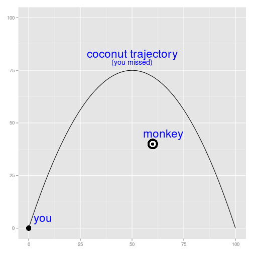

## Motivation

It has been brought to our attention that there have been sightings of an obnoxious monkey that likes to climb trees, aggressively taunt and harass passers-by, and generally disturb the peace. This is unacceptable behaviour, and must be stopped at once.

As we all know, obnoxious monkeys cannot be reasoned with. You cannot be diplomatic with them, no matter how articulate they may be. In fact, the only known way to scare away such a nuissance is, to throw coconuts at it until you hit it, and it acknowledges defeat.

To help you practice for your inevitable encounter, we have prepared an app that simulates the experience of lugging coconuts at a monkey while it continually taunts you. _DO NOT_ let the monkey get inside your head! Just hit it before its mind games get to you!

And don't be concerned about cruelty. As far as the obnoxious monkey is concerned, it's just playing with you, and can take a few hits.

--- &twocol

## App Specifics

*** =left

The "Hit the Monkey" app has two main purposes:

> 1. Target-practice!
    - Remember that projectiles move on a parabolic trajectory. See, that high school math is paying off!
    - Select an angle and speed
    - Launch the coconut!
> 2. Mental Fortitude
    - It's one thing to throw coconuts in a relaxing situation...
    - but it's another thing to do it while the target (monkey) is mocking you.
    - Resist its attempts at distraction, and focus on hitting your target!

*** =right

> * Get to know your battlefield:
 

--- &radio

## Pop Quiz

What is the one and only known way to get rid of a pesky monkey in a tree that's harassing people?

1. Ignore it; it will go away on its own.
2. Be diplomatic. Talk to it, and try to come to a civilized agreement.
3. _Throw coconuts at it until you hit it; there is no reasoning with these things!_
4. Ask nicely

*** .hint
You and I both know "polite discourse" won't work.

*** .explanation
Research has shown that no amount of polite discourse, being nice, diplomacy, or civilized pursuits, have ever worked. ONLY coconut-throwing.

---

## Pour Conclure

You are now ready to begin your training. Good luck, and happy throwing!

You may access the app for free at https://tzsebe.shinyapps.io/hitthemonkey

